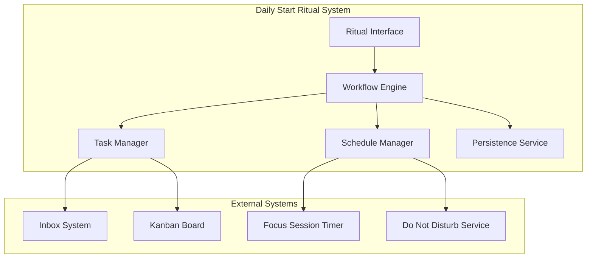
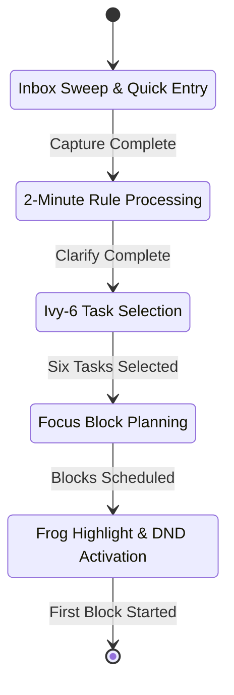

# Design Document

## Overview

The Daily Start Ritual is a guided workflow engine that orchestrates a structured morning productivity routine. The system combines proven productivity methodologies (GTD, Ivy Lee, Pomodoro) into a seamless 7-10 minute experience that prepares users for focused, productive work sessions.

The design emphasizes speed, keyboard accessibility, and minimal cognitive overhead while ensuring all decisions and outcomes are properly captured and persisted for future reference and analysis.

## Architecture

### System Architecture



### Workflow State Machine



## Components and Interfaces

### 1. Ritual Interface Controller

#### Purpose
Orchestrates the user interface flow and manages transitions between ritual steps.

#### Key Features
- **Step Navigation**: Automatic progression with manual override capability
- **Progress Tracking**: Visual indicators showing current step and overall progress
- **Keyboard Shortcuts**: Accelerated navigation for power users
- **Time Monitoring**: Real-time tracking with gentle reminders at 8-minute mark

#### Interface Design
```typescript
interface RitualController {
  currentStep: RitualStep;
  startTime: Date;
  elapsedTime: number;
  
  startRitual(): void;
  nextStep(): void;
  previousStep(): void;
  completeRitual(): RitualSummary;
  cancelRitual(): void;
}

enum RitualStep {
  CAPTURE = 'capture',
  CLARIFY = 'clarify', 
  SELECT = 'select',
  SCHEDULE = 'schedule',
  START = 'start'
}
```

### 2. Capture Engine

#### Purpose
Provides rapid task entry interface with minimal friction and maximum speed.

#### Key Features
- **Quick Entry**: Single-line input with instant save
- **Voice Input**: Speech-to-text for hands-free capture
- **Batch Processing**: Multiple task entry without page refreshes
- **Auto-categorization**: Smart tagging based on content analysis

#### Implementation Details
- **Input Method**: Text field with autocomplete and suggestions
- **Storage**: Immediate persistence to inbox with optimistic UI updates
- **Performance**: Sub-100ms response time for task entry
- **Accessibility**: Full keyboard navigation with screen reader support

### 3. Clarify Processor

#### Purpose
Implements GTD clarify step with 2-minute rule enforcement and action determination.

#### Key Features
- **Decision Interface**: Clear Do/Delegate/Defer options for each item
- **2-Minute Timer**: Visual countdown for quick action assessment
- **Batch Operations**: Process multiple similar items simultaneously
- **Context Preservation**: Maintain item details through processing

#### Decision Logic
```typescript
interface ClarifyDecision {
  itemId: string;
  action: 'do' | 'delegate' | 'defer';
  assignee?: string;
  dueDate?: Date;
  estimatedDuration: number;
  context: '@deep' | '@shallow';
}
```

### 4. Ivy-6 Selector

#### Purpose
Enforces exactly six task selection with prioritization and ordering capabilities.

#### Key Features
- **Constraint Enforcement**: Hard limit of six tasks with clear messaging
- **Drag-and-Drop Ordering**: Intuitive priority ranking interface
- **Task Filtering**: Smart suggestions based on importance and urgency
- **Visual Feedback**: Clear indication of selection state and remaining slots

#### Selection Algorithm
- **Priority Scoring**: Combine due date, importance, and estimated effort
- **Context Awareness**: Balance deep work and shallow tasks
- **Dependency Detection**: Identify and suggest prerequisite tasks
- **Workload Estimation**: Ensure realistic daily capacity

### 5. Schedule Planner

#### Purpose
Creates optimal focus block placement with Pomodoro timing and peak window awareness.

#### Key Features
- **Smart Scheduling**: Default placement in 09:00-12:00 peak window
- **Pomodoro Integration**: 25-minute work blocks with 5-minute breaks
- **Calendar Awareness**: Integration with existing calendar commitments
- **Flexibility**: Manual override for custom timing preferences

#### Scheduling Logic
```typescript
interface FocusBlock {
  id: string;
  startTime: Date;
  duration: number; // minutes
  taskIds: string[];
  type: 'pomodoro' | 'custom';
  breakDuration: number;
}

interface SchedulePreferences {
  peakWindow: TimeRange;
  defaultBlockDuration: number;
  breakDuration: number;
  maxBlocksPerDay: number;
}
```

### 6. Focus Session Launcher

#### Purpose
Initiates the first focus block with proper setup and distraction management.

#### Key Features
- **Frog Highlighting**: Prominent display of most important task
- **Do Not Disturb**: System-level notification blocking
- **Timer Integration**: Seamless handoff to focus session timer
- **Context Setup**: Prepare workspace for optimal focus

#### Integration Points
- **System Notifications**: Platform-specific DND activation
- **Timer Service**: Handoff to Pomodoro timer with task context
- **Progress Tracking**: Session logging and outcome capture
- **Recovery**: State restoration if session is interrupted

## Data Models

### Core Entities

```typescript
interface DailyRitual {
  id: string;
  date: Date;
  startTime: Date;
  completionTime?: Date;
  status: 'in_progress' | 'completed' | 'cancelled';
  
  capturedItems: string[]; // Task IDs
  clarifiedItems: ClarifyDecision[];
  selectedTasks: string[]; // Ivy-6 task IDs in priority order
  scheduledBlocks: FocusBlock[];
  
  metrics: RitualMetrics;
}

interface RitualMetrics {
  totalDuration: number; // minutes
  stepDurations: Record<RitualStep, number>;
  itemsCaptured: number;
  itemsClarified: number;
  blocksScheduled: number;
  keyboardShortcutsUsed: number;
}

interface RitualPreferences {
  autoAdvanceSteps: boolean;
  showTimeReminders: boolean;
  defaultBlockDuration: number;
  peakWorkWindow: TimeRange;
  keyboardShortcuts: Record<string, string>;
}
```

### State Management

```typescript
interface RitualState {
  current: DailyRitual | null;
  history: DailyRitual[];
  preferences: RitualPreferences;
  
  // Transient state
  currentStep: RitualStep;
  stepStartTime: Date;
  pendingItems: InboxItem[];
  selectedTaskIds: string[];
  draftSchedule: FocusBlock[];
}
```

## Error Handling

### User Experience Errors

1. **Time Overrun Scenarios**
   - **8-Minute Warning**: Gentle notification with option to continue or skip steps
   - **10-Minute Limit**: Automatic completion with current selections
   - **Recovery**: Save partial progress and offer resume option

2. **Selection Constraint Violations**
   - **Too Many Tasks**: Clear messaging with suggestion to defer less critical items
   - **No Tasks Selected**: Guidance to select at least one task for the day
   - **Invalid Ordering**: Automatic reordering with user confirmation

3. **Scheduling Conflicts**
   - **Calendar Conflicts**: Highlight conflicts and suggest alternative times
   - **Insufficient Time**: Recommend shorter blocks or task deferral
   - **Peak Window Unavailable**: Suggest next best time slots

### Technical Error Handling

1. **Persistence Failures**
   - **Auto-save**: Continuous state persistence every 30 seconds
   - **Recovery**: Restore from last saved state on restart
   - **Backup**: Local storage fallback for critical data

2. **Integration Failures**
   - **Timer Service**: Graceful degradation with manual timing
   - **Calendar Service**: Continue without calendar integration
   - **Notification Service**: Visual fallbacks for DND failures

## Testing Strategy

### Unit Testing

#### Workflow Engine Tests
- State transition validation
- Step completion criteria
- Time tracking accuracy
- Constraint enforcement

#### Component Tests
- Capture interface responsiveness
- Clarify decision processing
- Selection constraint validation
- Schedule generation algorithms

### Integration Testing

#### End-to-End Ritual Flow
- Complete ritual execution under normal conditions
- Time constraint validation (10-minute limit)
- Data persistence across all steps
- Integration with external systems

#### Performance Testing
- Interface responsiveness under load
- Memory usage during extended sessions
- Startup time optimization
- Keyboard shortcut response times

### User Experience Testing

#### Usability Scenarios
- First-time user onboarding
- Power user keyboard navigation
- Error recovery workflows
- Accessibility compliance

#### Time-based Testing
- Normal completion (7-10 minutes)
- Rushed completion (under 5 minutes)
- Extended sessions (over 10 minutes)
- Interrupted session recovery

## Performance Considerations

### Response Time Targets
- **Interface Launch**: <2 seconds cold start
- **Step Transitions**: <200ms between steps
- **Task Entry**: <100ms save confirmation
- **Schedule Generation**: <500ms for complex calendars

### Memory Management
- **State Cleanup**: Clear transient data after completion
- **History Limits**: Maintain 30-day ritual history
- **Cache Management**: Efficient task and calendar data caching
- **Background Processing**: Minimize CPU usage during ritual

### Scalability Considerations
- **Large Inboxes**: Efficient handling of 100+ items
- **Complex Schedules**: Support for busy calendar integration
- **Historical Data**: Performant queries over months of ritual data
- **Concurrent Users**: Multi-user support for shared systems