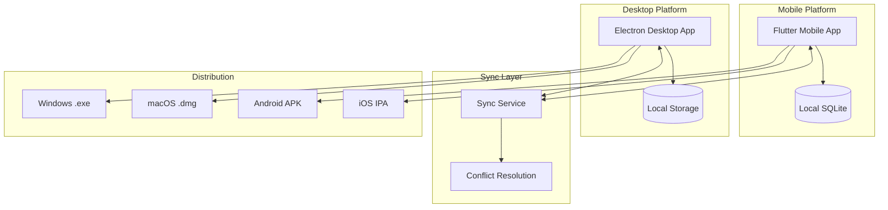
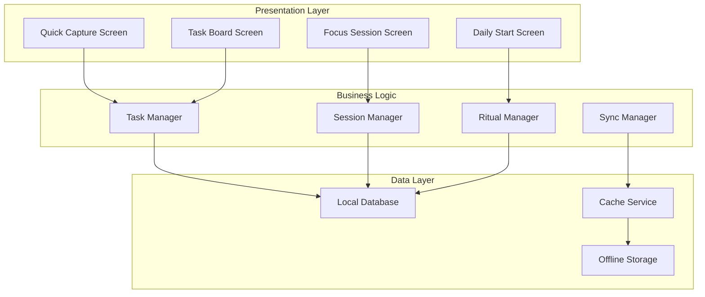
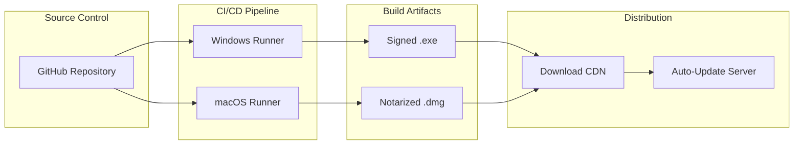

# Design Document

## Overview

The Flutter Mobile App extends the Personal OS productivity system to mobile platforms while maintaining seamless integration with the desktop application. The design follows a hybrid architecture with local-first data storage, background synchronization, and platform-specific optimizations for both mobile and desktop environments.

The system consists of three main components:
1. **Flutter Mobile App** - Cross-platform mobile application (iOS/Android)
2. **Desktop Application** - Electron-based app with .exe (Windows) and .dmg (macOS) packages
3. **Sync Service** - Real-time data synchronization between platforms

## Architecture

### High-Level System Architecture



### Mobile App Architecture



## Components and Interfaces

### 1. Flutter Mobile App Components

#### Quick Capture Interface
- **Purpose**: Rapid task entry with minimal friction
- **Features**: Voice-to-text, keyboard shortcuts, offline queuing
- **Performance**: Sub-2-second launch time, 1-second save time

#### Focus Session Manager
- **Purpose**: Timer management and distraction blocking
- **Features**: Pomodoro presets, Do Not Disturb integration, session logging
- **Integration**: Native platform notification controls

#### Daily Start Ritual Engine
- **Purpose**: Guided morning productivity routine
- **Features**: Step-by-step workflow, Ivy-6 task selection, time tracking
- **Constraints**: 10-minute completion target

#### Task Board Interface
- **Purpose**: Mobile-optimized Kanban board
- **Features**: Touch-friendly drag-drop, WIP limit enforcement, pull-based transitions
- **Sync**: Real-time updates with conflict resolution

### 2. Desktop Application Components

#### Electron Main Process
- **Purpose**: System integration and window management
- **Features**: Menu bar, system tray, auto-updater
- **Platform**: Cross-platform with native packaging

#### Renderer Process
- **Purpose**: UI rendering and user interactions
- **Technology**: React/Vite with TypeScript
- **Features**: Keyboard-first navigation, focus management

#### Packaging System
- **Windows**: NSIS .exe installer with code signing using SignTool
- **macOS**: .dmg package with Apple Developer ID signing and notarization
- **Build Process**: Platform-specific runners (Windows for .exe, macOS for .dmg)
- **Auto-update**: Electron-builder update mechanism with signed updates
- **Distribution**: Direct download and auto-update channels

### 3. Sync Service Architecture

#### Data Synchronization
- **Protocol**: WebSocket for real-time updates, REST for bulk operations
- **Conflict Resolution**: Last-write-wins with user notification
- **Offline Support**: Queue-based with exponential backoff retry

#### Security
- **Authentication**: JWT tokens with refresh mechanism
- **Encryption**: TLS 1.3 for transport, AES-256 for local storage
- **Privacy**: Local-first architecture with optional cloud sync

## Data Models

### Core Entities

```typescript
interface Task {
  id: string;
  title: string;
  notes?: string;
  context: '@deep' | '@shallow';
  estimatedPomodoros: number;
  dueDate?: Date;
  priority: 'high' | 'medium' | 'low';
  status: 'backlog' | 'ready' | 'doing' | 'review' | 'done';
  createdAt: Date;
  updatedAt: Date;
  syncStatus: 'synced' | 'pending' | 'conflict';
}

interface FocusSession {
  id: string;
  taskId: string;
  startTime: Date;
  duration: number; // minutes
  mode: 'pomodoro' | 'custom';
  outcome: 'completed' | 'interrupted' | 'extended';
  notes?: string;
  platform: 'mobile' | 'desktop';
}

interface DailyRitual {
  id: string;
  date: Date;
  selectedTasks: string[]; // Ivy-6 task IDs
  completedSteps: string[];
  duration: number; // minutes
  scheduledBlocks: FocusBlock[];
}

interface SyncEvent {
  id: string;
  entityType: 'task' | 'session' | 'ritual';
  entityId: string;
  action: 'create' | 'update' | 'delete';
  timestamp: Date;
  deviceId: string;
  data: any;
}
```

### Database Schema

#### Mobile (SQLite)
- **tasks** table with full-text search index
- **sessions** table with date-based partitioning
- **rituals** table with JSON column for flexible data
- **sync_queue** table for offline operations
- **device_state** table for sync metadata

#### Desktop (LowDB/SQLite)
- Shared schema with mobile for consistency
- Additional **preferences** table for desktop-specific settings
- **window_state** table for UI persistence

## Error Handling

### Mobile App Error Scenarios

1. **Network Connectivity Loss**
   - Queue operations locally
   - Display offline indicator
   - Retry with exponential backoff
   - User notification on sync restoration

2. **Sync Conflicts**
   - Detect conflicts during merge
   - Present conflict resolution UI
   - Allow user to choose resolution strategy
   - Log conflict events for analysis

3. **App Crashes/Force Quit**
   - Auto-save every 30 seconds
   - Restore session state on restart
   - Recover unsaved quick captures
   - Maintain timer state across restarts

### Desktop App Error Scenarios

1. **Packaging/Installation Issues**
   - Signed certificates for both platforms
   - Fallback installation methods
   - Clear error messages with support links
   - Automatic update recovery

2. **Cross-Platform Compatibility**
   - Platform-specific feature detection
   - Graceful degradation for unsupported features
   - Consistent behavior across Windows/macOS
   - Native look-and-feel per platform

## Packaging and Distribution Architecture

### Windows .exe Production
- **Build Environment**: Windows runner with Node.js and electron-builder
- **Installer Type**: NSIS installer for professional installation experience
- **Code Signing**: 
  - Use SignTool with code signing certificate
  - EV certificate recommended for SmartScreen reputation
  - Timestamp signing for long-term validity
- **Package Contents**: Application files, dependencies, uninstaller, registry entries
- **Distribution**: Direct download, auto-update channel, optional Microsoft Store

### macOS .dmg Production  
- **Build Environment**: macOS runner with Xcode command line tools
- **Package Type**: DMG disk image with drag-to-Applications workflow
- **Code Signing**:
  - Apple Developer ID Application certificate
  - Notarization through Apple's notary service
  - Stapling for offline verification
- **Package Contents**: .app bundle, background image, symbolic link to Applications
- **Distribution**: Direct download, auto-update channel, optional Mac App Store

### Build Pipeline Architecture


## Testing Strategy

### Mobile Testing

#### Unit Tests
- Business logic components (Task Manager, Sync Manager)
- Data persistence layer
- Offline queue management
- Conflict resolution algorithms

#### Integration Tests
- Sync service communication
- Platform-specific features (notifications, Do Not Disturb)
- Database migrations and schema changes
- Cross-platform data compatibility

#### UI Tests
- Critical user flows (Quick Capture, Daily Start)
- Touch interactions and gestures
- Accessibility compliance
- Performance benchmarks

### Desktop Testing

#### Packaging Tests
- Windows .exe installer validation and signing verification
- macOS .dmg creation, signing, and notarization process
- Code signing certificate validation for both platforms
- Auto-update functionality testing
- Cross-platform installer behavior verification
- Package integrity and security validation

#### Cross-Platform Tests
- Feature parity between Windows/macOS
- Native integration testing
- Performance benchmarks
- Memory usage monitoring

### End-to-End Testing

#### Sync Testing
- Multi-device synchronization scenarios
- Conflict resolution workflows
- Offline-to-online transitions
- Data integrity validation

#### User Journey Tests
- Complete Daily Start ritual across platforms
- Focus session handoff between devices
- Task management workflow continuity
- Error recovery scenarios

## Performance Considerations

### Mobile Optimization
- **Startup Time**: Target <2 seconds cold start
- **Battery Usage**: Minimize background processing
- **Memory**: Keep under 100MB baseline usage
- **Storage**: Efficient local caching with cleanup

### Desktop Optimization
- **Launch Time**: Target <3 seconds application start
- **Resource Usage**: Minimal CPU when idle
- **Package Size**: Optimize bundle size for distribution
- **Update Speed**: Incremental updates when possible

### Sync Performance
- **Latency**: Target <1 second for small changes
- **Bandwidth**: Compress sync payloads
- **Reliability**: 99.9% sync success rate
- **Scalability**: Support up to 10,000 tasks per user